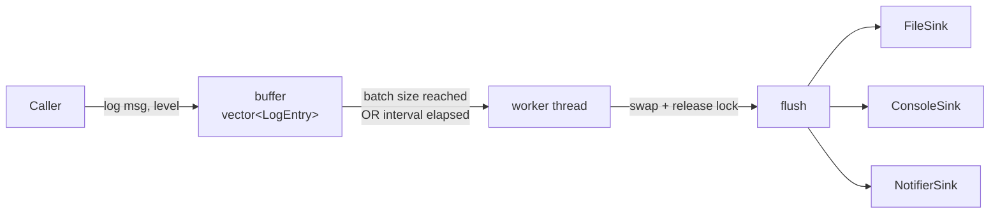

# Async Batched Logger

A small systems-level C++23 project: a non-copyable, non-movable, thread-safe logger with batched/timed async flushing and pluggable output sinks. Built as a hands-on project to consolidate modern C++ fundamentals — RAII, PIMPL, concurrency, and `std::expected`-based error handling — alongside ML/Python work.

Not intended as a production logging library (see [spdlog](https://github.com/gabime/spdlog) for that). The goal was depth on a small surface area: get the concurrency, ownership, and testing right on something simple enough to reason about end to end.

---

## Design



- **One worker thread**, woken by a single compound condition-variable predicate: `buffer.size() >= batch_size || stop`. No separate timer object — `wait_for(lock, interval, predicate)` already expresses "flush on batch size OR interval, whichever comes first."
- **Swap-and-release buffering**: `log()` pushes under a lock and returns immediately. The worker locks only long enough to `std::move` the buffer out and unlock — actual sink I/O happens with no lock held, so a slow disk write never blocks other callers of `log()`.
- **PIMPL** on both `Logger` and `FileSink` — hides `std::thread`/`std::mutex`/`std::condition_variable`/`std::ofstream` from the headers entirely, so changing internal implementation details doesn't force a recompile of every consumer.
- **Pluggable sinks** via a `Sink` abstract base (`FileSink`, `ConsoleSink`, `NotifierSink`), each with its own severity threshold. Filtering is enforced through a Non-Virtual-Interface–style hook: `protected filter()` formats and level-checks each line, then calls a `private` pure-virtual `do_write()` that only the sink's own implementation can define — a derived sink can't skip the filtering step, and can't be called out-of-process either, since `do_write` isn't public.
- **`std::expected`-based error propagation, not exceptions**: `Sink::write()` returns `expected<void, LogError>`; `Logger::flush()` aggregates every sink's result into `expected<void, vector<LogError>>` so one failing sink doesn't hide another's failure. The worker thread is the one place these errors terminate — it's a genuine dead end for propagation (nothing is waiting on a `std::thread` entry point's return value), so it logs to `stderr` there rather than swallowing or rethrowing.
- **Move-only, not movable**: copy is deleted everywhere (`Logger`, all `Sink`s). Move construction/assignment on `Logger` is deleted too, deliberately — the worker thread is bound to the object's address at construction time, so a live `Logger` genuinely can't be relocated safely without either restructuring the thread to bind to the `Impl` instead of `this`, or losing the guarantee that the destructor's stop/join sequence runs against the right object. Chose the simpler, provably-safe option (delete move) over the more flexible one.

---

## Testing

GoogleTest, `TEST_F` fixtures, run under AddressSanitizer/UndefinedBehaviorSanitizer by default and separately under ThreadSanitizer (`-DENABLE_TSAN=ON`, its own build directory — TSan can't share a binary with ASan/UBSan).

- **Output verification** — `std::cout`/`std::cerr` captured per-test by swapping `rdbuf()` to an `ostringstream`, restored in `TearDown`.
- **Compile-time invariants** — `static_assert(!std::is_copy_constructible_v<Logger>)` and friends, verifying the deleted special members actually stayed deleted, independent of any runtime test.
- **Genuine concurrency testing, not just "didn't crash"** — the multi-threaded `log()` test asserts on an `unordered_multiset` comparison rather than exact output order, since real concurrent interleaving is supposed to be non-deterministic. Multiset (not `set`) specifically to catch duplicate/lost messages, which a `set` would silently collapse.
- **Deterministic failure injection** — sink failure tests point `FileSink` at a nonexistent directory rather than relying on filesystem permissions, which are flaky across CI runners and meaningless when run as root.

---

## Build

Requires a C++23 compiler (`std::expected`, `std::format`). GoogleTest is pulled via CMake `FetchContent`, no manual install needed.

```bash
cmake -B build
cmake --build build -j
ctest --test-dir build
```

Optional ThreadSanitizer build for the concurrency test:

```bash
cmake -B build-tsan -DENABLE_TSAN=ON
cmake --build build-tsan -j
```

---

## Notable bugs caught during development

A few worth mentioning because they were subtle enough to survive a clean compile and a passing test run:

- **Moving a live `Logger` was UB** — the worker thread was bound to `this` at construction; moving the object left the thread dereferencing a moved-from (null) `pimpl_` on the original address. Reproduced deliberately under ASan before fixing by deleting move entirely.
- **A `span`-as-owning-error-type bug** — an early design returned `std::unexpected` wrapping a `span` over a local `vector`, dangling the instant the function returned. Same root cause as returning a dangling `string_view`, just recurring in `std::expected`'s error slot.

---

## Possible extensions

Not implemented, but scoped out as natural next steps:

- Replace the manual stop-flag + `join()` with `std::jthread` + `std::stop_token`
- Compile-time-checked formatted logging (`log(level, "user {} failed", id)` via `std::format_string`)
- `std::source_location` for automatic file/line capture on each call
- Bounded buffer with an explicit backpressure policy (block / drop-newest / drop-oldest)
